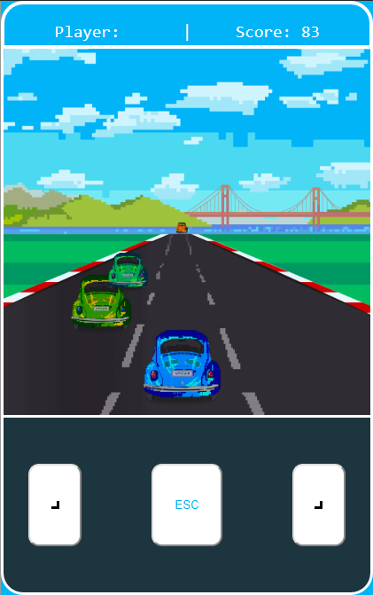

This project was bootstrapped with [Create React App](https://github.com/facebook/create-react-app).

# Endure React Car Game

## Available Scripts
all the scripts are referenced in package-json
they could be instaled througth the command

### `npm install`

In the project directory, you can run:

### `npm start`

Runs the game in the development mode. 
Open [http://localhost:3000](http://localhost:3000) to view it in the browser.

The page will reload if you make edits. 
You will also see any lint errors in the console.

### `npm run build`

Builds the app for production to the `build` folder. 
It correctly bundles React in production mode and optimizes the build for the best performance.

The build is minified and the filenames include the hashes. 
Your app is ready to be deployed!

See the section about [deployment](https://facebook.github.io/create-react-app/docs/deployment) for more information.

## More About

This is a prototype of a game made for [Upnid](https://www.googleadservices.com/pagead/aclk?sa=L&ai=DChcSEwi9u9eirI7mAhVW3IYKHbx2Az8YABAAGgJ2dQ&ohost=www.google.com&cid=CAESP-D25zVucd10z14BW3Qnz8vrwV1pMPQJR2btsLefJl67iK6ZDgPKrZ4NlYr_GVwt3wlwEhmI4fx6nB9tIxKz-Q&sig=AOD64_1wH3UrAnt2rA47sj1WFBEPA8QwLQ&q=&ved=2ahUKEwjTtMairI7mAhUyq1kKHWGVBC4Q0Qx6BAgNEAE&adurl=) chalenge.

## For Future

+ made some optimizations to stop the frame rate drops
+ add colision to enemys
+ put the game to run on a server
+ finish a online leaderboard 